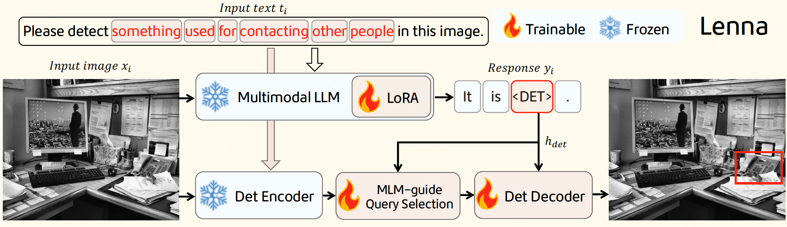

# Lenna: Language Enhanced Reasoning Detection Assistant
<a href='https://github.com/Meituan-AutoML/Lenna'></a>
<a href='https://arxiv.org/abs/2312.02433'></a>
<p>
<div align="justify">
With the fast-paced development of multimodal large language models (MLLMs), we can now converse with AI systems in natural languages to understand images. However, the reasoning power and world knowledge embedded in the large language models have been much less investigated and exploited for image perception tasks. In this work, we propose <b>Lenna</b> a <b>L</b>anguage <b>e</b>nhanced reaso<b>n</b>ing detectio<b>n</b> <b>a</b>ssistant, which utilizes the robust multimodal feature representation of MLLMs, while preserving location information for detection. This is achieved by incorporating an additional <b>&lt;DET&gt;</b> token in the MLLM vocabulary that is free of explicit semantic context but serves as a prompt for the detector to identify the corresponding position. To evaluate the reasoning capability of Lenna, we construct a ReasonDet dataset to measure its performance on reasoning-based detection. Remarkably, Lenna demonstrates outstanding performance on ReasonDet and comes with significantly low training costs. It also incurs minimal transferring overhead when extended to other tasks.
</div>
</p>
<p>
  <p align="center"></p>
  <p align="center">Lenna Architecture</p>
</p>


## Cite

```bibtex
@misc{wei2023lenna,
      title={Lenna: Language Enhanced Reasoning Detection Assistant}, 
      author={Fei Wei and Xinyu Zhang and Ailing Zhang and Bo Zhang and Xiangxiang Chu},
      year={2023},
      eprint={2312.02433},
      archivePrefix={arXiv},
      primaryClass={cs.CV}
}
```

## Acknowledgement

This repo benefits from [LISA](https://github.com/dvlab-research/LISA), [GroundingDINO](https://github.com/IDEA-Research/GroundingDINO), [LLaVA](https://github.com/haotian-liu/LLaVA) and [Vicuna](https://github.com/lm-sys/FastChat). 


## License
This repository is released under the Apache 2.0 license as found in the [LICENSE](https://github.com/Meituan-AutoML/Lenna/blob/main/LICENSE) file.

